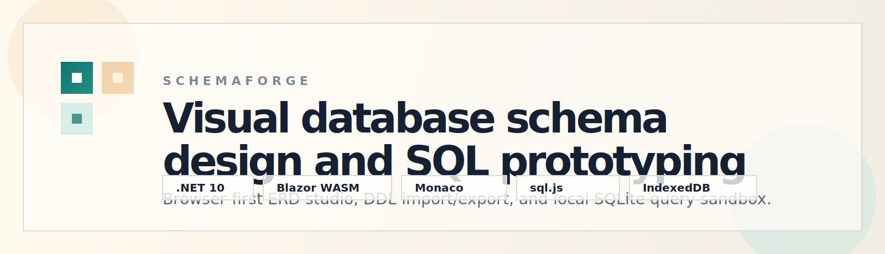
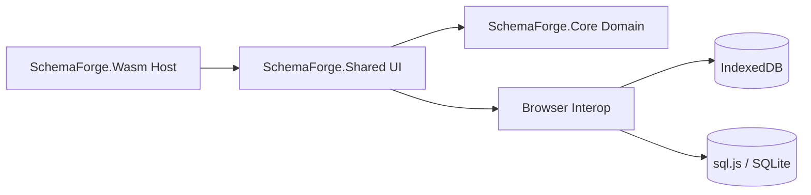

#  SchemaForge

<p align="center">
  
</p>

<p align="center">
  <strong>SchemaForge</strong> is a browser-first database schema designer and SQL playground built with Blazor WebAssembly.
  It combines a visual ERD canvas, multi-dialect DDL generation, DDL import, and a local SQLite sandbox in one client-side workspace.
</p>

<p align="center">
  <a href="https://github.com/pradhankukiran/schema-forge/actions/workflows/ci.yml"></a>
  
  
  
  
  
</p>

## What It Does

- Design relational schemas visually on a drag-and-link canvas.
- Generate DDL for SQLite, PostgreSQL, MySQL, and SQL Server.
- Import existing `CREATE TABLE` and related DDL into the document model.
- Run ad hoc SQL against an in-browser SQLite sandbox.
- Export the workspace as SQL, PNG, or SVG.
- Persist projects locally with autosave and recent-project recovery.

## Why SchemaForge

SchemaForge is meant for fast database ideation without needing a backend, a local database server, or a heavyweight desktop tool. The entire app runs client-side, which makes it useful for demos, prototyping, workshops, and schema review sessions.

## Feature Highlights

| Area | Capability |
| --- | --- |
| Visual design | ERD-style table canvas, relationship creation, auto-layout, property editing |
| Query workflow | Monaco-powered editor, query tabs, history, apply-to-SQLite flow |
| DDL tooling | Multi-dialect generation plus import back into the internal schema model |
| Persistence | IndexedDB-backed projects, autosave, recent project launcher |
| Portability | Browser-only app, vendored runtime assets, static hosting friendly |
| Samples | Dense built-in sample schemas for Blog, E-Commerce, and Northwind |

## Tech Stack

| Layer | Technology |
| --- | --- |
| Frontend app | Blazor WebAssembly on `.NET 10` |
| UI composition | Razor components, scoped services, CSS in [`app.css`](src/SchemaForge.Shared/wwwroot/css/app.css) |
| Core domain | Plain .NET models and services in [`src/SchemaForge.Core`](src/SchemaForge.Core) |
| SQL editor | Monaco Editor, vendored under [`src/SchemaForge.Shared/wwwroot/vendor`](src/SchemaForge.Shared/wwwroot/vendor) |
| Browser database | `sql.js` running SQLite in the browser |
| Local storage | IndexedDB through JS interop |
| Testing | xUnit + `Microsoft.NET.Test.Sdk` + `coverlet.collector` |
| CI | GitHub Actions in [`.github/workflows/ci.yml`](.github/workflows/ci.yml) |
| Deployment | Static publish output deployed to Vercel via [`vercel.json`](vercel.json) |

## Architecture



The codebase is split into three main projects:

- [`src/SchemaForge.Wasm`](src/SchemaForge.Wasm): application bootstrap, dependency injection, and static host configuration.
- [`src/SchemaForge.Shared`](src/SchemaForge.Shared): Razor UI, layout, interop wrappers, serialization, and browser-facing services.
- [`src/SchemaForge.Core`](src/SchemaForge.Core): schema models, layout logic, DDL parsing/generation, and state management.

## Repository Layout

```text
src/
  SchemaForge.Core/      Core models, DDL generation/parsing, state, layout
  SchemaForge.Shared/    Razor UI, interop, services, wwwroot assets
  SchemaForge.Wasm/      Blazor WebAssembly host
tests/
  SchemaForge.Core.Tests/ xUnit coverage for core state and parsing behavior
scripts/
  vercel-install-dotnet.sh
  vercel-build.sh
```

## Local Development

### Prerequisites

- .NET SDK `10.0.104` or compatible `10.0.x` feature band

### Run

```bash
dotnet restore SchemaForge.slnx
dotnet build SchemaForge.slnx
dotnet run --project src/SchemaForge.Wasm/SchemaForge.Wasm.csproj --launch-profile http
```

By default, the app runs as a client-side Blazor WebAssembly site and stores projects locally in the browser.

## Validation

```bash
dotnet test tests/SchemaForge.Core.Tests/SchemaForge.Core.Tests.csproj --configuration Release --no-restore
dotnet publish src/SchemaForge.Wasm/SchemaForge.Wasm.csproj -c Release -o output --nologo
```

## Deployment

SchemaForge is configured for static deployment on Vercel.

- [`vercel.json`](vercel.json) points Vercel at the published `output/wwwroot` directory.
- [`scripts/vercel-install-dotnet.sh`](scripts/vercel-install-dotnet.sh) bootstraps the exact .NET SDK version declared in [`global.json`](global.json).
- [`scripts/vercel-build.sh`](scripts/vercel-build.sh) performs the publish step in Vercel's build environment.

If you prefer a manual local publish:

```bash
dotnet publish src/SchemaForge.Wasm/SchemaForge.Wasm.csproj -c Release -o output --nologo
```

Then serve the contents of `output/wwwroot` from any static host that supports SPA rewrites.

## Built-In Samples

- `Blog`: users, posts, revisions, media, categories, and tags.
- `E-Commerce`: products, carts, orders, payments, shipments, and reviews.
- `Northwind`: expanded sales sample with territories and customer demographics.

## Notes

- Monaco and `sql.js` are vendored into the repo to avoid runtime CDN dependencies.
- The app is browser-only and does not require a server-side database.
- Project data is stored locally in the current browser profile unless you export it.
